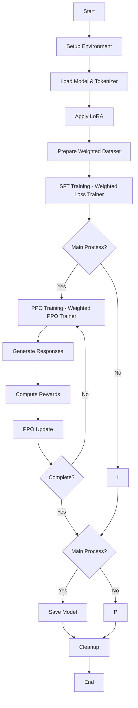

### Day-4 HW_4 Draft

#### Logic

- Prepare an Alpaca dataset which mainly composed of a question, an answer and whether to call search engine, and train a model as the agent.

1. Use **DeepSeek-R1-Distill-Qwen-7B** to generate the **Q-A-S (Quest-Answer-Search_or_not) Dataset** on the base of **SQuAD 2.0**.
2. Train **Qwen3-0.6B** with the Q-A-S Dataset to grant it with long thoughts and capability of deciding whether to search or not.

#### Codes

##### *generate_squad_dataset*

- System Prompts

```python

SYS_PROMPT = """You are an AI assistant capable of complex reasoning. Follow this process:
1. Think deeply in the <think> tag
2. Call search when real-time data/unknown knowledge is needed
3. Search call format: <|SEARCH|>"""

```

- Stage 1: Long Thoughts

```python

stage1_prompt = (
    f"Question: {question}\n"
    "Please think deeply. Output format: <think>Your thoughts</think>\n"
    "Thinking:"
)

# ...

inputs = tokenizer(stage1_prompt, return_tensors="pt").to(model.device)
    stage1_output = model.generate(
        **inputs,
        max_new_tokens=params["max_new_tokens"],
        temperature=params["temperature"],
        top_p=params["top_p"],
        repetition_penalty=params["repetition_penalty"],
        do_sample=True,
        pad_token_id=tokenizer.eos_token_id
    )

```

- Stage 2: Tell If Search or Not

```python

stage2_prompt = (
    f"{SYS_PROMPT}\n\nQuestion: {question}\n"
    f"Thinking content: {thoughts}\n"
    "Based on this thinking, is a search for recent information needed?\n"
    "If search is needed, output: <|SEARCH|>\n"
    "If not needed, output nothing\n"
    "Decision:"
)

# ...

inputs = tokenizer(stage2_prompt, return_tensors="pt").to(model.device)
stage2_output = model.generate(
    **inputs,
    max_new_tokens=10,
    temperature=0.3,
    do_sample=False,
    pad_token_id=tokenizer.eos_token_id
)

```

##### *train_model.py*



#### Note

> The codes are unfinished. Future improvement involve debugs and connect to mmcp servers.