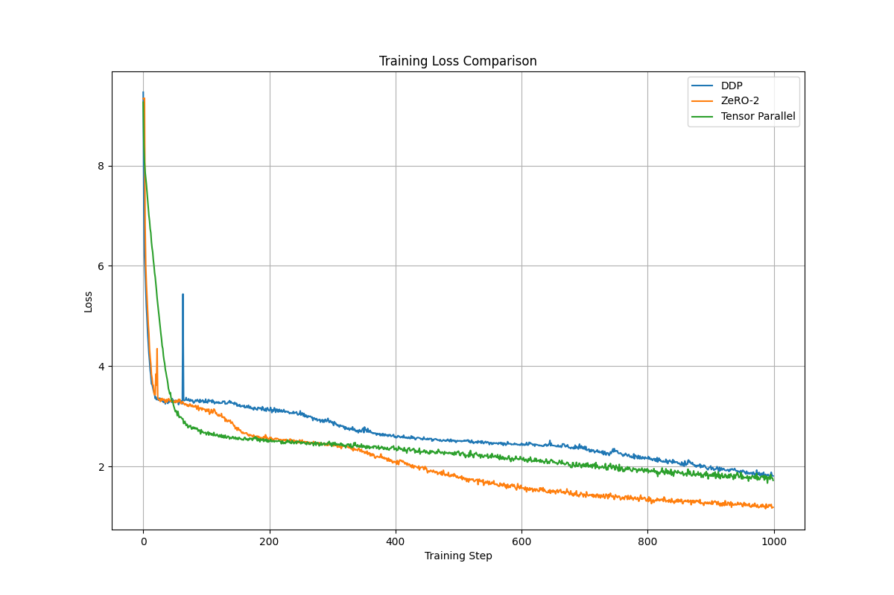
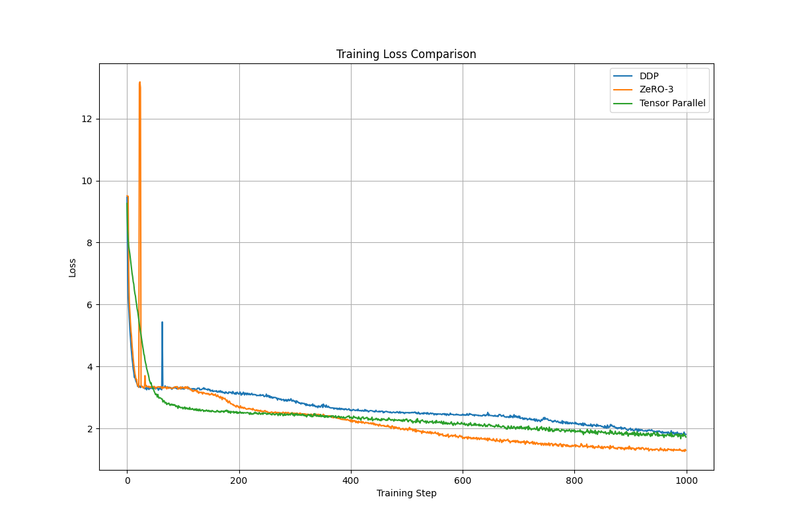
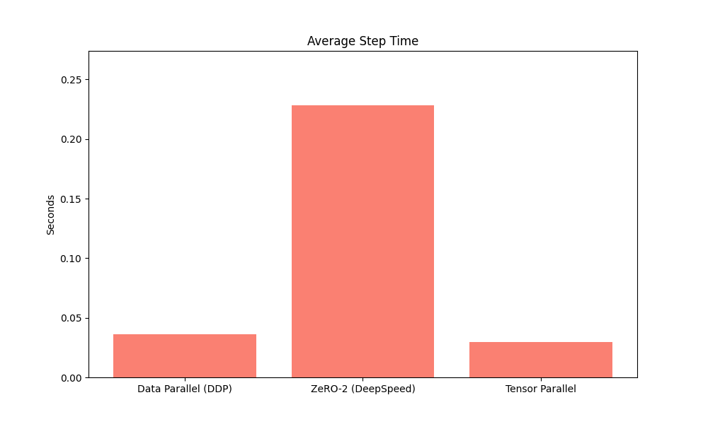
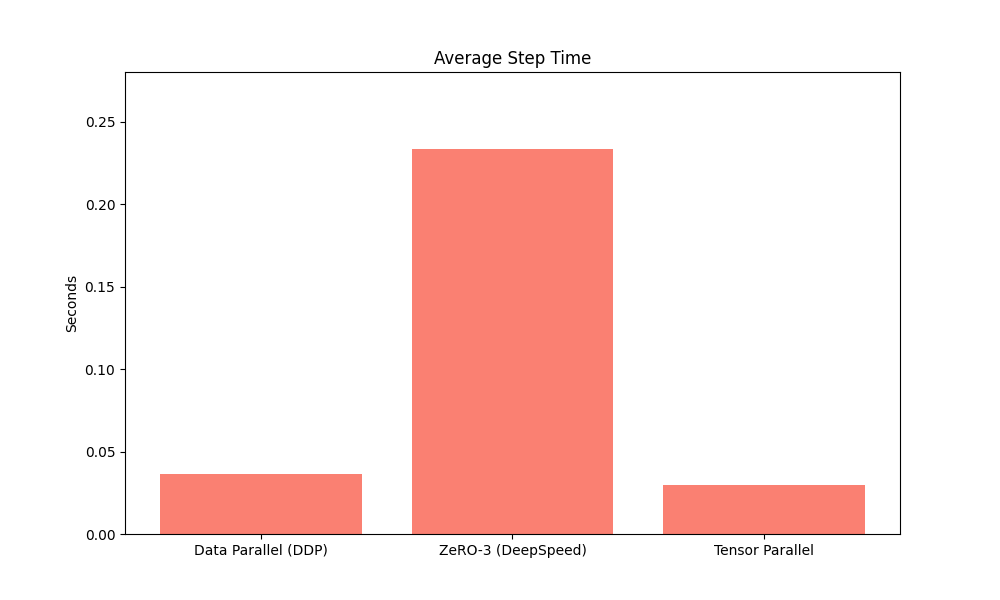
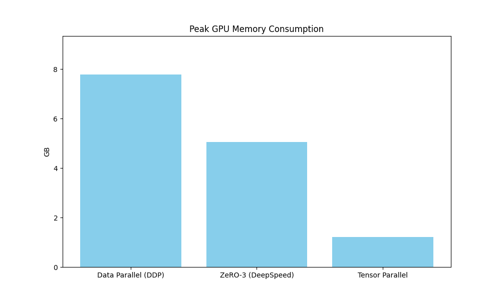

### Day-5 HW 5-3

#### Codes (Key Parts)

> Simulate a nanoGPT by *model.py* and *utils.py*

- Data Parallel

```python

# 初始化分布式进程组
dist.init_process_group(
    backend="nccl",  # NVIDIA GPU 使用 nccl
    rank=rank,
    world_size=world_size
)
torch.cuda.set_device(rank)  # 设置当前GPU

# ...

# 训练循环
for step in range(1000):
    start_time = time.time()
    
    # 获取数据并移动到当前GPU
    x, y = get_batch('train', block_size=config.block_size, batch_size=32)
    x, y = x.to(rank), y.to(rank)
    
    # 前向传播
    logits, loss = ddp_model(x, targets=y)
    
    # 反向传播
    optimizer.zero_grad()
    loss.backward()
    optimizer.step()
    
    # 计算步骤时间
    step_time = time.time() - start_time
    
    # 记录指标（仅rank0）
    if rank == 0:
        # 获取最大内存使用量（GB）
        mem = torch.cuda.max_memory_allocated(rank) / 1e9
        log_file.write(f"{step},{loss.item():.4f},{mem:.2f},{step_time:.4f}\n")
        
        # 每100步打印进度
        if step % 100 == 0:
            print(f"Step {step}: Loss={loss.item():.4f}, "
                    f"GPU_mem={mem:.2f}GB, Time={step_time:.4f}s")

```

- DeepSpeed ZeRO-2

```bash

deepspeed --num_gpus 2 deepspeed_train.py

```

```python

# DeepSpeed 配置
    ds_config = {
        "train_batch_size": 32,
        "gradient_accumulation_steps": 1,
        "optimizer": {
            "type": "Adam",
            "params": {
                "lr": 0.0003,
                "betas": [0.9, 0.95],
                "eps": 1e-8
            }
        },
        "fp16": {
            "enabled": True,
            "loss_scale": 0,
            "loss_scale_window": 1000,
            "initial_scale_power": 16,
            "hysteresis": 2,
            "min_loss_scale": 1
        },
        "zero_optimization": {
            "stage": 3,  # 修改为3测试ZeRO-3
            "contiguous_gradients": True,
            "overlap_comm": True,
            "reduce_scatter": True,
            "reduce_bucket_size": 5e8,
            "allgather_bucket_size": 5e8
        },
        "distributed": {
            "backend": "nccl",
        },
        "activation_checkpointing": {
            "partition_activations": True,
            "contiguous_memory_optimization": True,
            "cpu_checkpointing": False
        },
        "steps_per_print": 100,
        "wall_clock_breakdown": True
    }
    
    # DeepSpeed初始化
    model_engine, optimizer, _, _ = deepspeed.initialize(
        model=model,
        model_parameters=model.parameters(),
        config=ds_config
    )

```

- Tensor Parallel

```python

class TensorParallelWrapper(nn.Module):
    def __init__(self, module, rank, world_size):
        super().__init__()
        self.module = module
        self.rank = rank
        self.world_size = world_size
        
    def forward(self, x):
        # 分割输入数据
        x_chunks = x.chunk(self.world_size, dim=-1)
        x_local = x_chunks[self.rank].contiguous()
        
        # 本地计算
        out_local = self.module(x_local)
        
        # 聚合结果
        out_list = [torch.zeros_like(out_local) for _ in range(self.world_size)]
        dist.all_gather(out_list, out_local)
        return torch.cat(out_list, dim=-1)


    # ...

    # 计算通信量（GB）
        comm_gb = comm_bytes / 1e9
        total_comm_bytes += comm_bytes
        step_time = time.time() - start_time

```

#### Results

> ZeRO-2 and ZeRO-3 Performances are nearly the same

| Strategy              | Avg Loss | Peak Memory (GB) | Avg Step Time (s) | Throughput (steps/s) | Avg Comm (GB/step) |
|-----------------------|----------|------------------|-------------------|----------------------|--------------------|
| Data Parallel (DDP)   | 2.62     | 7.78             | 0.0362            | 27.6                 | NaN                |
| ZeRO-2 (DeepSpeed)    | 2.03     | 5.48             | 0.228             | 4.38                 | NaN                |
| ZeRO-3 (DeepSpeed)    | 2.18     | 5.06             | 0.234             | 4.28                 | NaN                |
| Tensor Parallel       | 2.37     | 1.21             | 0.0295            | 33.8                 | 0.0334             |

---

<br/>









